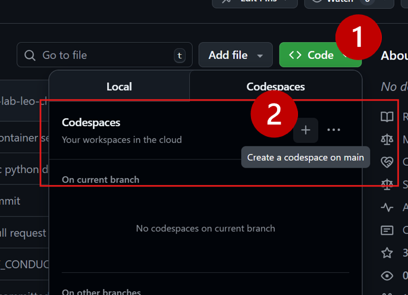
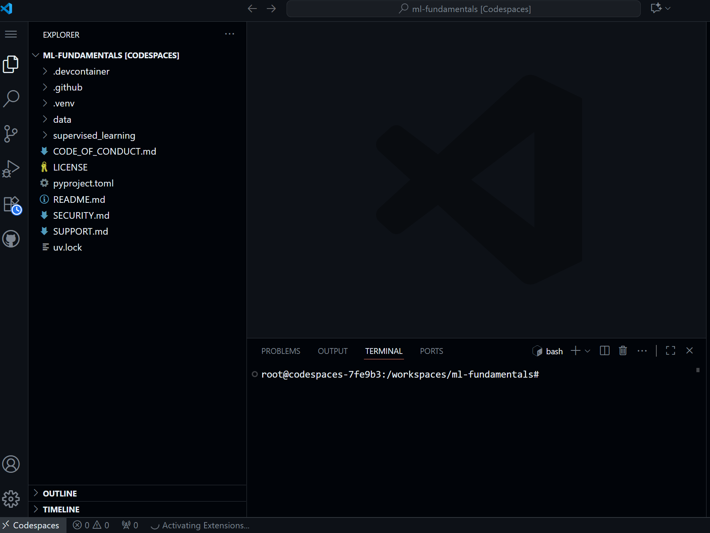

# Running in Github Codespaces

A Github Codespace is a development environment that's hosted in the cloud.  This is the ideal choice if you cannot or would rather not use your local development machine.

The lab has been tested on a Github Codespace and should run fine with the provided devcontainer.

 

## Step by step instructions

### 1. Create your Codespace

Go to the repository and select `Code -> Codespaces (tab)`.

 

### 2. Wait for the Codespace to be created

It may take a couple of minutes for the Codespace environment to be created the first time, after which you will see something like the UI below. The Codespace comes with a Devcontainer, and if you look closely in the terminal, you'll notice a post-create script running - it's installing all Python dependencies within a virtual environment.

 

### 3. Open a notebook & select a kernel

You can now open a Jupyter notebook (e.g. from the /supervised_learning/regression's  notebooks).

Each time you open a notebook for the first time, click "select kernel" in the top-right of the notebook, and choose "Python Environments..."

Go with the recommended virtual env (located within your repo's working directory):

You should now be ready to go.  Try running a cell to ensure the everything is running fine!
