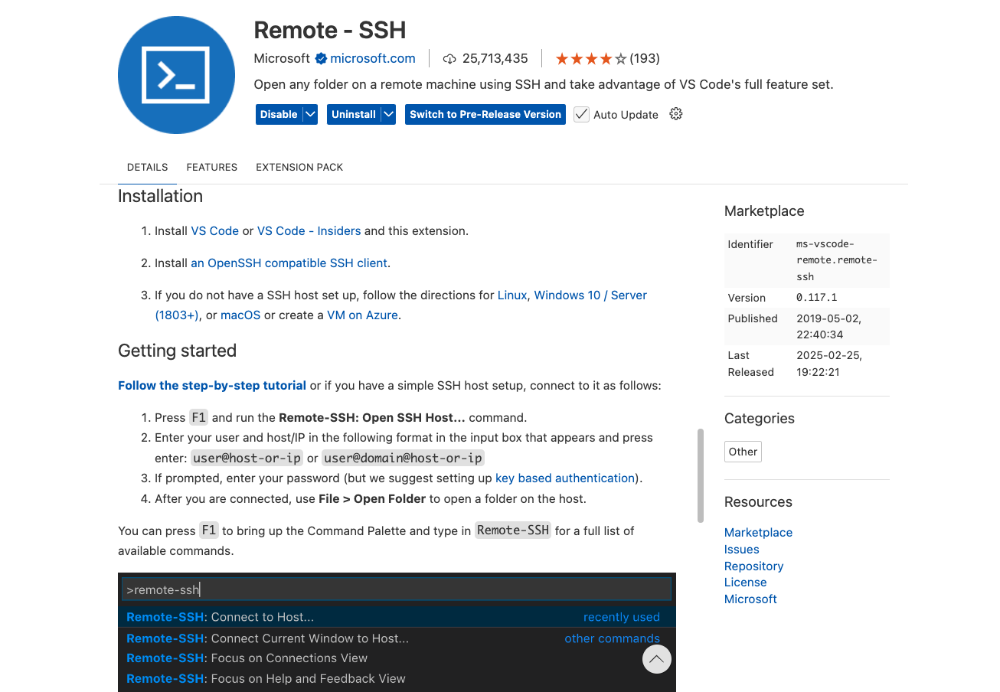
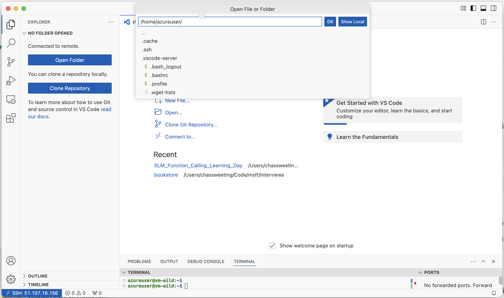
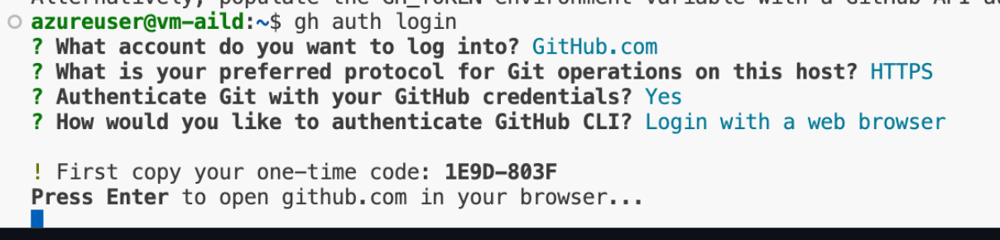

# Using a remote VM - accessing via VS Code

This repo is not very heavy, so running on a remote VM is not strictly necessary.

<br>

## 1. Create an Azure Virtual Machine

- Log into Azure and switch subscription if necessary

- Create a VM and download the SSH key.

- Move the key to `~/.ssh` and `chmod 600 <path-to-key>` (macOS/linux laptop).

    Or just leave it in the Downoads directory (Windows laptop).

<br>

## 2. Connect to the VM with VS Code

1. Download and install VS Code <https://code.visualstudio.com/download>

2. Open extensions (CMD + SHIFT + P) and search for 'Remote SSH'

3. Follow the instructions to install the extension and connect to your VM:

    

    When prompted for an SSH connection string, it should take the form:

    ```bash
    ssh -i <path to the .pem file> username@<public ipaddress of the VM>
    ```

4. Once you've connected to your VM, a new VS Code window should open and you'll be able to select a folder and open a terminal on the VM.

    

    (note: your remote host should be in the bottom-left of VS Code)

<br>

## 3. Download the repo to the VM

In VS Code connected to the remote VM, open a terminal and then:

1. Install the Github CLI

    ```bash
    sudo apt update
    sudo apt install gh
    ```

2. Authenticate using the Github CLI

    ```bash
    gh auth login
    ```

    Follow the instructions and authenticate via a web browser.

    

3. Clone the repo

    ```bash
    gh repo clone https://github.com/microsoft/ml-fundamentals.git
    ```

4. Open the repo folder in VS Code

<br>

## 4. Install the Python dependencies

1. Install uv - <https://github.com/astral-sh/uv>

    ```bash
    curl -LsSf https://astral.sh/uv/install.sh | sh

    source $HOME/.local/bin/env
    ```

2. Install dependencies & create virtual env:

    ```bash
    uv sync
    ```

<br>

## 5. Use the notebooks

You're now ready to [run the notebooks in VS Code](using-notebooks-in-vs-code.md).