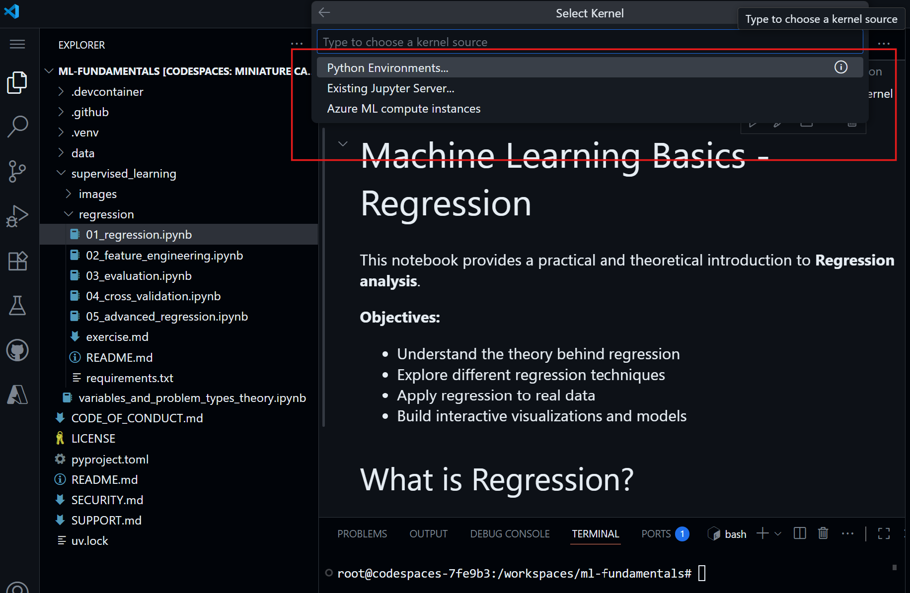
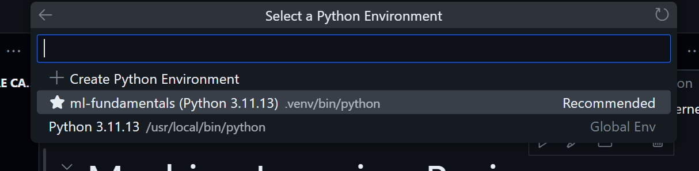

# Using Jupyter notebooks within VS Code

## Install extensions

You will require the following VS Code extensions:

1. Python extension (by Microsoft)
2. Jupyter extension (by Microsoft)

## Open a notebook

Once both extensions (above) are installed, open a .ipynb notebook file in VS Code.

You should see a “Select Kernel” prompt at the top right.  Choose "Python Environments..."

Go with the recommended virtual env (located within your repo's working directory):

Try running a cell to ensure the everything is running fine.

 

## How to use Jupyter notebooks

If you're coming to Jupyter notebooks for the first time, here are some common shortcuts:

| Action                                    | Shortcut      |
| ----------------------------------------- | ------------- |
| Run the current cell and move to the next | Shift + Enter |
| Insert a new cell above                   | Esc -> a      |
| Delete the current cell                   | Esc -> dd     |
| Switch a cell to Markdown mode            | Esc -> m      |

Where '->' indicates the shortcut follows the Esc key.

 

## Trouble shooting

Debugging the extensions in VS Code by running `code —list-extensions` in the terminal.